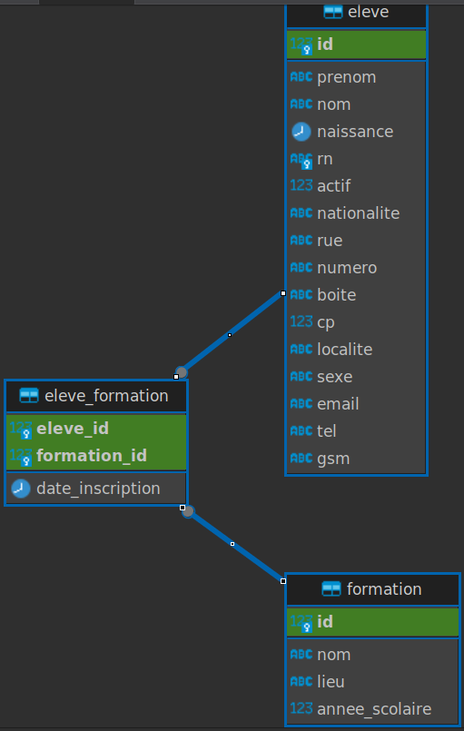

<h1>Exercices SQL</h1>


<div style="text-align: right">
<i>Johnny Piette</i>
</div>

****
<h1>Table des matières</h1>

<!-- @import "[TOC]" {cmd="toc" depthFrom=1 depthTo=2 orderedList=false} -->

<!-- code_chunk_output -->

- [Introduction](#introduction)
- [Copier les DB exercices](#copier-les-db-exercices)
- [Exercice n°1 - Importation des fichiers de base de données](#exercice-n1---importation-des-fichiers-de-base-de-données)
- [Exercice n°2 - Notre premier SELECT *](#exercice-n2---notre-premier-select-)
- [Exercice n°3 - SELECT ch1, ch2, etc.](#exercice-n3---select-ch1-ch2-etc)
- [Exercice n°4 - Notre premier WHERE](#exercice-n4---notre-premier-where)
- [Exercice n°5 - WHERE   AND](#exercice-n5---where---and)
- [Exercice n°6 - WHERE   IS NULL IS NOT NULL](#exercice-n6---where---is-null-is-not-null)
- [Exercice n°7 - WHERE     AND](#exercice-n7---where-----and)
- [Exercice n°8 - WHERE  sur une DATE](#exercice-n8---where--sur-une-date)
- [Exercice n°9 - WHERE sur des DATES](#exercice-n9---where-sur-des-dates)
- [Exercice n°10 - WHERE    avec LIKE '%quelquechose' = se termine par 'quelquechose'](#exercice-n10---where----avec-like-quelquechose--se-termine-par-quelquechose)
- [Exercice n°11 - WHERE    avec LIKE '%quelquechose%' = contient 'quelquechose'](#exercice-n11---where----avec-like-quelquechose--contient-quelquechose)
- [Exercice n°12 - WHERE    avec LIKE 'quelquechose%' = commence par 'quelquechose'](#exercice-n12---where----avec-like-quelquechose--commence-par-quelquechose)
- [Exercice n°13 - WHERE   AND     OR](#exercice-n13---where---and-----or)
- [Exercice n°14 - ORDER BY](#exercice-n14---order-by)
- [Exercice n°15 - ORDER BY](#exercice-n15---order-by)
- [Exercice n°16 - AVG](#exercice-n16---avg)
- [Exercice n°17.1 - MIN, MAX, SUM](#exercice-n171---min-max-sum)
- [Exercice n°17.2 - COUNT(*)](#exercice-n172---count)
- [Exercice n°17.3 - COUNT(champ)](#exercice-n173---countchamp)
- [Exercice n°18 - GROUP BY](#exercice-n18---group-by)
- [Exercice n°19 - GROUP BY](#exercice-n19---group-by)
- [Exercice n°20 - GROUP BY](#exercice-n20---group-by)
- [Exercice n°21 - GROUP BY](#exercice-n21---group-by)
- [Exercice n°22 - INNER JOIN](#exercice-n22---inner-join)
- [Exercice n°23 - INNER JOIN](#exercice-n23---inner-join)
- [Exercice n°24 - INNER JOIN](#exercice-n24---inner-join)
- [Exercice n°25.1 - INNER JOIN](#exercice-n251---inner-join)
- [Exercice n°25.2 - Nouvelle DB !! :-) - employees](#exercice-n252---nouvelle-db------employees)
- [Exercice n°25.3 - INNER JOIN](#exercice-n253---inner-join)
- [Exercice n°25.4 - INNER JOIN](#exercice-n254---inner-join)
- [Exercice n°25.5 - INNER JOIN - Analyse des titres d'emploi et des salaires](#exercice-n255---inner-join---analyse-des-titres-demploi-et-des-salaires)
- [Exercice n°25.6 - INNER JOIN](#exercice-n256---inner-join)
- [Exercice n°26 - CREATE DATABASE / CREATE TABLE](#exercice-n26---create-database--create-table)
- [Exercice n°27 - CREATE DATABASE / CREATE TABLE](#exercice-n27---create-database--create-table)
- [Exercice n°28 - INSERT INTO](#exercice-n28---insert-into)
- [Exercice n°29 - INSERT INTO](#exercice-n29---insert-into)
- [Exercice n°30 - UPDATE](#exercice-n30---update)
- [Exercice n°31 - UPDATE](#exercice-n31---update)
- [Exercice n°32 - UPDATE](#exercice-n32---update)
- [Exercice n°33 - DELETE](#exercice-n33---delete)
- [Exercice n°34 - VIEW - Création d'une vue](#exercice-n34---view---création-dune-vue)
- [Exercice n°35 - VIEW - Création d'une vue](#exercice-n35---view---création-dune-vue)
- [Exercice n°36 - Naming convention](#exercice-n36---naming-convention)
- [Exercice n°37 - FUNCTIONS](#exercice-n37---functions)
- [Exercice n°38 - FUNCTIONS avec paramètres](#exercice-n38---functions-avec-paramètres)
- [Exercice n°39 - FUNCTIONS avec paramètres](#exercice-n39---functions-avec-paramètres)
- [Exercice n°40 - FUNCTIONS avec paramètres](#exercice-n40---functions-avec-paramètres)
- [Exercice n°41 - FUNCTIONS avec paramètres](#exercice-n41---functions-avec-paramètres)
- [Exercice n°42 - ALTER TABLE](#exercice-n42---alter-table)
- [Exercice n°43 - Création d'utilisateurs](#exercice-n43---création-dutilisateurs)
- [Exercice n°44 - Attribution de Privilèges](#exercice-n44---attribution-de-privilèges)
- [Exercice n°45 - Limitation des privilèges](#exercice-n45---limitation-des-privilèges)
- [Exercice n°46 - Révocation de Privilèges et Suppression d'Utilisateurs](#exercice-n46---révocation-de-privilèges-et-suppression-dutilisateurs)
- [Exercice n°47 - Création d'un Utilisateur pour une Application](#exercice-n47---création-dun-utilisateur-pour-une-application)
- [Exercice n°48 - Création de l'utilisateur php_user](#exercice-n48---création-de-lutilisateur-php_user)
- [Exercice n°49 - Révocation du privilège GRANT OPTION](#exercice-n49---révocation-du-privilège-grant-option)
- [Exercice n°50 - Sous-requêtes de liste](#exercice-n50---sous-requêtes-de-liste)
- [Exercice n°51 - Les index](#exercice-n51---les-index)

<!-- /code_chunk_output -->


<!--
- [Introduction](#introduction)
- [Copier les DB exercices](#copier-les-db-exercices)
- [Exercice n°1 - Importation des fichiers de base de données](#exercice-n1---importation-des-fichiers-de-base-de-données)
- [Exercice n°2 - Notre premier SELECT \*](#exercice-n2---notre-premier-select-)
- [Exercice n°3 - SELECT ch1, ch2, etc.](#exercice-n3---select-ch1-ch2-etc)
- [Exercice n°4 - Notre premier WHERE](#exercice-n4---notre-premier-where)
- [Exercice n°5 - WHERE   AND](#exercice-n5---where---and)
- [Exercice n°6 - WHERE   IS NULL IS NOT NULL](#exercice-n6---where---is-null-is-not-null)
- [Exercice n°7 - WHERE     AND](#exercice-n7---where-----and)
- [Exercice n°8 - WHERE  sur une DATE](#exercice-n8---where--sur-une-date)
- [Exercice n°9 - WHERE sur des DATES](#exercice-n9---where-sur-des-dates)
- [Exercice n°10 - WHERE    avec LIKE '%quelquechose' = se termine par 'quelquechose'](#exercice-n10---where----avec-like-quelquechose--se-termine-par-quelquechose)
- [Exercice n°11 - WHERE    avec LIKE '%quelquechose%' = contient 'quelquechose'](#exercice-n11---where----avec-like-quelquechose--contient-quelquechose)
- [Exercice n°12 - WHERE    avec LIKE 'quelquechose%' = commence par 'quelquechose'](#exercice-n12---where----avec-like-quelquechose--commence-par-quelquechose)
- [Exercice n°13 - WHERE   AND     OR](#exercice-n13---where---and-----or)
- [Exercice n°14 - ORDER BY](#exercice-n14---order-by)
- [Exercice n°15 - ORDER BY](#exercice-n15---order-by)
- [Exercice n°16 - AVG](#exercice-n16---avg)
- [Exercice n°17.1 - MIN, MAX, SUM](#exercice-n171---min-max-sum)
- [Exercice n°17.2 - COUNT(\*)](#exercice-n172---count)
- [Exercice n°17.3 - COUNT(champ)](#exercice-n173---countchamp)
- [Exercice n°18 - GROUP BY](#exercice-n18---group-by)
- [Exercice n°19 - GROUP BY](#exercice-n19---group-by)
- [Exercice n°20 - GROUP BY](#exercice-n20---group-by)
- [Exercice n°21 - GROUP BY](#exercice-n21---group-by)
- [Exercice n°22 - INNER JOIN](#exercice-n22---inner-join)
- [Exercice n°23 - INNER JOIN](#exercice-n23---inner-join)
- [Exercice n°24 - INNER JOIN](#exercice-n24---inner-join)
- [Exercice n°25 - INNER JOIN](#exercice-n25---inner-join)
- [Exercice n°26 - CREATE DATABASE / CREATE TABLE](#exercice-n26---create-database--create-table)
- [Exercice n°27 - CREATE DATABASE / CREATE TABLE](#exercice-n27---create-database--create-table)
- [Exercice n°28 - INSERT INTO](#exercice-n28---insert-into)
- [Exercice n°29 - INSERT INTO](#exercice-n29---insert-into)
- [Exercice n°30 - UPDATE](#exercice-n30---update)
- [Exercice n°31 - UPDATE](#exercice-n31---update)
- [Exercice n°32 - UPDATE](#exercice-n32---update)
- [Exercice n°33 - DELETE](#exercice-n33---delete)
- [Exercice n°34 - FUNCTIONS](#exercice-n34---functions)
- [Exercice n°35 - FUNCTIONS avec paramètres](#exercice-n35---functions-avec-paramètres)
- [Exercice n°35 - FUNCTIONS avec paramètres](#exercice-n35---functions-avec-paramètres-1)
-->

## Introduction
Toute commande dans mysql doit se terminer par un point virgule ;

Si vous ne le faites pas mysql ne sait pas que vous avez terminé la commande en cours.

Pour savoir dans quelle base de données vous êtes actuellement, on va customiser notre prompt.
Dans la console mysql, tapez:
```bash
prompt <\d>
```

## Copier les DB exercices
Copier les fichiers SQL se trouvant via cette adresse: [Base de données des exercices ](https://github.com/ZamBoyle/Eqla-SGBD/raw/master/DB/DB.zip)

Décompresssez ce fichier DB.zip et mettez le répertoire DB dans votre dépôt Eqla-Exercices.
Demandez-moi le mot de passe pour décompresser le fichier.

## Exercice n°1 - Importation des fichiers de base de données
1. Allez dans le répertoire d'exercices SQL
2. Connectez-vous au SGBD MySQL:
   ```bash
   mysql -u root -p
   ```
3. Entrez votre mot de passe
4. Importez le script qui va générer la base de données BlindCode:
   ```sql
   source BlindCode.sql 
   ```
5. Importez le script qui va générer la base de données Localites (Ca va prendre plus temps: attendez): 
   ```sql
   source Localites.sql
   ```
6. Importez le script qui va générer la base de données Ventes: 
   ```sql
   source Ventes.sql
   ```
7. Importez le script qui va générer la base de données Ventes: 
   ```sql
   source Pays.sql
   ```
8. Importez le script qui va générer la base de données BlindCode2:
   ```sql
   source BlindCode2.sql 
   ```
9. Importez le script qui va générer la base de données Exercices:
   ```sql
   source Exercices.sql 
   ```      
10.  Pour avoir la liste des bases de données présentes: SHOW DATABASES;
11. Vous devriez voir dans la liste des bases de données: BlindCode, BlindCode2, Exercices, Localites, Ventes, Pays
12. Si vous avez des erreurs appelez-moi.

## Exercice n°2 - Notre premier SELECT *
1. Connectez-vous au SGBD MySQL: **mysql -u root -p**
2. Entrez votre mot de passe.
3. Si vous n'êtes pas dans la DB BlindCode, tapez: **use BlindCode;**
4. Ecrivez l'instruction qui affichez tous les enregistrements de la table Eleve: tous les champs à l'aide du caractère *
5. Ecrivez l'instruction qui affichez tous les enregistrements de la table formation: tous les champs à l'aide du caractère *

## Exercice n°3 - SELECT ch1, ch2, etc.
1. Allez dans le répertoire d'exercices SQL
2. Connectez-vous au SGBD MySQL: **mysql -u root -p**
3. Entrez votre mot de passe
4. Si vous n'êtes pas dans la DB BlindCode, tapez: **use BlindCode;**
5. Affichez tous les enregistrements de la table Eleve avec les champs suivants: Nom, Prenom, Email
6. Affichez tous les enregistrements de la table formation avec les champs: Nom, Lieux

## Exercice n°4 - Notre premier WHERE
1. Allez dans le répertoire d'exercices SQL
2. Connectez-vous au SGBD MySQL: **mysql -u root -p**
3. Entrez votre mot de passe
4. Si vous n'êtes pas dans la DB BlindCode, tapez: **use BlindCode;**
5. Affichez tous les élèves de sexe Féminin.
6. Affichez tous les élèves de sexe Masculin.
7. Affichez Le nom, le prénom, la localite des élèves qui habitent sur le CP 1030.

## Exercice n°5 - WHERE   AND
1. Allez dans le répertoire d'exercices SQL
2. Connectez-vous au SGBD MySQL: **mysql -u root -p**
3. Entrez votre mot de passe
4. Si vous n'êtes pas dans la DB BlindCode, tapez: **use BlindCode;**
5. Affichez tous les élèves de Sexe Masculin ET ayant comme CP 1348

## Exercice n°6 - WHERE   IS NULL IS NOT NULL
1. Allez dans le répertoire d'exercices SQL
2. Connectez-vous au SGBD MySQL: **mysql -u root -p**
3. Entrez votre mot de passe
4. Si vous n'êtes pas dans la DB BlindCode, tapez: **use BlindCode;**
5. Affichez tous les élèves qui n'ont pas de numéro de téléphone: On utilisera IS NULL
6. A l'inverse, affichez les élèves qui ont un numéro de téléphone: On utilisera IS NOT NULL.

## Exercice n°7 - WHERE     AND
1. Allez dans le répertoire d'exercices SQL
2. Connectez-vous au SGBD MySQL: **mysql -u root -p**
3. Entrez votre mot de passe
4. Si vous n'êtes pas dans la DB BlindCode, tapez: **use BlindCode;**
5. Affichez les élèves dont le code postal est dans les 1000 (il y a donc plusieurs valeurs).

## Exercice n°8 - WHERE  sur une DATE
1. Allez dans le répertoire d'exercices SQL
2. Connectez-vous au SGBD MySQL: **mysql -u root -p**
3. Entrez votre mot de passe
4. Si vous n'êtes pas dans la DB BlindCode, tapez: **use BlindCode;**
5. Affichez les élèves nés après 1980: Le format de la date est année/Mois/Jour.
6. Affichez les élèves nés avant 1980: Le format de la date est année/Mois/Jour.

## Exercice n°9 - WHERE sur des DATES
1. Allez dans le répertoire d'exercices SQL
2. Connectez-vous au SGBD MySQL: **mysql -u root -p**
3. Entrez votre mot de passe
4. Si vous n'êtes pas dans la DB BlindCode, tapez: **use BlindCode;**
5. Affichez les élèves nés entre 1980 ET 1990.
6. Affichez les élèves qui ne sont pas nés entre 1980 ET 1990.
   Pour cela, vous devez inverser la requête précédente.  Pour rappel, dans une inversion de condition:
   - AND devient OR
   - OR devient AND
   - = devient \<\>
   - \<\> devient =
   - \> devient \<=
   - \>= devient \<
   - \< devient \>=
   - \<= devient \>
   Exemple: `a \< b AND d >= e` devient `a \>= b OR d \< e`
   A vous de jouer. :-)
7. Reprenez la requète des élèves nés entre 1980 ET 1990. Encadrez celle-ci de parenthèses et ajoutez juste devant le NOT. Vous devriez avoir le même résultat que la requête précédente. Parfois quand on a des requêtes complexes, il est plus facile de les inverser en ajoutant un NOT devant la requête. C'est plus facile que de tout inverser. :-)

## Exercice n°10 - WHERE    avec LIKE '%quelquechose' = se termine par 'quelquechose'
1. Allez dans le répertoire d'exercices SQL
2. Connectez-vous au SGBD MySQL: **mysql -u root -p**
3. Entrez votre mot de passe
4. Si vous n'êtes pas dans la DB BlindCode, tapez: **use BlindCode;**
5. Affichez les élèves qui ont une adresse de type gmail.com
6. Affichez les élèves qui n'ont pas une adresse de type gmail.com

## Exercice n°11 - WHERE    avec LIKE '%quelquechose%' = contient 'quelquechose'
1. Allez dans le répertoire d'exercices SQL
2. Connectez-vous au SGBD MySQL: **mysql -u root -p**
3. Entrez votre mot de passe
4. Si vous n'êtes pas dans la DB BlindCode, tapez: **use BlindCode;**
5. Affichez les élèves qui ont une adresse  qui n'ont pas une adresse de type gmail.com

## Exercice n°12 - WHERE    avec LIKE 'quelquechose%' = commence par 'quelquechose'
1. Allez dans le répertoire d'exercices SQL
2. Connectez-vous au SGBD MySQL: **mysql -u root -p**
3. Entrez votre mot de passe
4. Si vous n'êtes pas dans la DB BlindCode, tapez: **use BlindCode;**
5. Affichez les élèves dont le nom commence par 'be'

## Exercice n°13 - WHERE   AND     OR
1. Allez dans le répertoire d'exercices SQL
2. Connectez-vous au SGBD MySQL: **mysql -u root -p**
3. Entrez votre mot de passe
4. Si vous n'êtes pas dans la DB Localite, tapez: **use Localites;**
5. Vous utiliserez la table localite pour les points suivants.
6. Affichez toutes les communes sur le code Postal 4280
7. Affichez toutes les communes sur le code Postal 4280 et dont la commune commence par 'b' ou par 'a'
8. Affichez les CP et les noms des communes de la Province de Liège: les CP sont compris entre 4000 et 4999

## Exercice n°14 - ORDER BY    
1. Allez dans le répertoire d'exercices SQL
2. Connectez-vous au SGBD MySQL: **mysql -u root -p**
3. Entrez votre mot de passe
4. Si vous n'êtes pas dans la DB BlindCode, tapez: **use BlindCode;**
5. Affichez les champs: Prenom, Nom, Sexe, Naissance et triez dans l'ordre alphabétique sur le nom et puis le prenom.
6. Ensuite, triez dans l'ordre inverse le nom.
7. Triez les élèves du plus agé au plus jeune.
8. Ensuite, triez dans l'ordre inverse.

## Exercice n°15 - ORDER BY 
1. Allez dans le répertoire d'exercices SQL
2. Connectez-vous au SGBD MySQL: **mysql -u root -p**
3. Entrez votre mot de passe
4. Si vous n'êtes pas dans la DB BlindCode, tapez: **use BlindCode;**
5. On va ici créer une colonne dynamiquement dans le résultat qu'on nommera Age. On utilisera le AS comme vu au cours dans la Exercice n°"champs calculés"
   Je vous demande d'afficher le prenom, nom et l'age des eleves.
   Pour cela, je vous rappelle que la fonction YEAR()   permet de récupérer l'année d'une date et que CURDATE() donne la date du jour. Pour avoir l'age approximatif de l'élève on pourrait donc faire Année en cours(2022)-Année de naissance(ex:1974) AS Age
6. Reprenez la requête précédente et affichez les élèves du plus jeune au plus vieux.
7. Ensuite, du plus vieux au plus jeune.
8. Réécrivez vos deux requêtes pour ne traîter que des élèves de BlindCodeJava.

## Exercice n°16 - AVG
1. Allez dans le répertoire d'exercices SQL
2. Connectez-vous au SGBD MySQL: **mysql -u root -p**
3. Entrez votre mot de passe.
4. Si vous n'êtes pas dans la DB BlindCode, tapez: **use BlindCode;**
5. Reprenez la requête de la Exercice n°15.
6. Modifiez-la pour que l'on ait l'age moyen des élèves.

## Exercice n°17.1 - MIN, MAX, SUM
1. Allez dans le répertoire d'exercices SQL
2. Connectez-vous au SGBD MySQL: **mysql -u root -p**
3. Entrez votre mot de passe
4. Si vous n'êtes pas dans la DB Ventes, tapez: **use ventes;**
5. Affichez le prix maximum des produits
6. Affichez le prix minimum des produits
7. Affichez le prix total de tous les produits en tenant compte du stock de chaque produit. :-)

## Exercice n°17.2 - COUNT(*)
1. Allez dans le répertoire d'exercices SQL
2. Connectez-vous au SGBD MySQL: **mysql -u root -p**
3. Si vous n'êtes pas dans la DB Ventes, tapez: **use ventes;**
4. Affichez le nombre total de produits différents.
5. Utilisez la DB BlindCode, tapez: **use BlindCode;**
6. Affichez le nombre total d'élèves qui ont plus de 25 ans et appelez cette colonne 'nb_eleves'.

## Exercice n°17.3 - COUNT(champ)
1. Allez dans le répertoire d'exercices SQL
2. Connectez-vous au SGBD MySQL: **mysql -u root -p**
3. Si vous n'êtes pas dans la DB Ventes, tapez: **use ventes;**
4. 

## Exercice n°18 - GROUP BY
1. Allez dans le répertoire d'exercices SQL
2. Connectez-vous au SGBD MySQL: **mysql -u root -p**
3. Entrez votre mot de passe
4. Si vous n'êtes pas dans la DB Ventes, tapez: **use ventes;**
5. Affichez pour chaque catégorie, son stock. (Indice utilisez aussi SUM)

## Exercice n°19 - GROUP BY
1. Allez dans le répertoire d'exercices SQL
2. Connectez-vous au SGBD MySQL: **mysql -u root -p**
3. Entrez votre mot de passe.
4. Si vous n'êtes pas dans la DB BlindCode, tapez: **use BlindCode;**
5. Affichez pour chaque sexe, le nombre total. (Indice COUNT)
6. Affichez pour chaque nationalite, le nombre total.

## Exercice n°20 - GROUP BY
1. Allez dans le répertoire d'exercices SQL
2. Connectez-vous au SGBD MySQL: **mysql -u root -p**
3. Entrez votre mot de passe.
4. Si vous n'êtes pas dans la DB Pays, tapez: **use Pays;**
5. Faites un DESC Pays, pour voir sa structure.
6. Affichez pour chaque continent, combien il a de pays. On n'utilisera qu'une seule table: Pays. Donc pour le continent à afficher on prendra le champ continent. (On fera mieux plus tard.)

## Exercice n°21 - GROUP BY
1. Allez dans le répertoire d'exercices SQL
2. Connectez-vous au SGBD MySQL: **mysql -u root -p**
3. Entrez votre mot de passe.
4. Si vous n'êtes pas dans la DB BlindCode2, tapez: **use BlindCode2;**
5. Expliquez ce que fait cette commande SQL:
```sql
SELECT YEAR(date_inscription) As 'Annee Inscription', COUNT(date_inscription)
FROM eleve_formation
group by YEAR(date_inscription);
```
6. Pourquoi avoir utilisé la Fonction **YEAR** ? Pour vous aider, comparez sans le **YEAR**:
```sql
SELECT date_inscription As 'Annee Inscription', COUNT(date_inscription)
FROM eleve_formation
group by date_inscription;
```


1. **Explication de la commande SQL** :
   La commande SQL donnée effectue les actions suivantes :
   - `SELECT YEAR(date_inscription) As 'Annee Inscription'` : Cette partie extrait l'année de la colonne `date_inscription` de chaque enregistrement dans la table `eleve_formation` et la nomme 'Annee Inscription'.
   - `COUNT(date_inscription)` : Cette partie compte le nombre d'enregistrements (élèves inscrits) pour chaque année.
   - `FROM eleve_formation` : Indique que la requête récupère les données de la table `eleve_formation`.
   - `GROUP BY YEAR(date_inscription)` : Cette partie groupe les résultats par année d'inscription. Cela signifie que pour chaque année distincte dans la table, la requête comptera le nombre d'élèves inscrits cette année-là.

2. **Utilisation de la fonction YEAR** :
   - L'utilisation de `YEAR(date_inscription)` permet de regrouper et de compter les enregistrements par année, sans tenir compte des mois et des jours. Cela donne un aperçu de combien d'élèves se sont inscrits chaque année.
   - Sans le `YEAR`, la requête `GROUP BY date_inscription` grouperait les données par date exacte, y compris l'année, le mois et le jour. Cela donnerait un compte de combien d'élèves se sont inscrits à chaque date précise, ce qui pourrait mener à des résultats très fragmentés et moins utiles pour une analyse annuelle.


## Exercice n°22 - INNER JOIN


1. Allez dans le répertoire d'exercices SQL
2. Connectez-vous au SGBD MySQL: **mysql -u root -p**
3. Entrez votre mot de passe.
4. Si vous n'êtes pas dans la DB Pays, tapez: **use Pays;**
5. Affichez chaque pays et le nom du continent dont il fait partie.
6. Faites un tri ascendant sur le nom du pays.
7. Je vous conseille d'utiliser le mot clef **AS** après le nom du pays et après le nom du continent. Sinon vous allez avoir deux colonnes Name pour le pays et le continent. Ce qui n'est pas très pratique...


A. Affichage des pays et de leurs continents :
```sql
SELECT p.name AS Nom_Pays, c.name AS Nom_Continent
FROM Pays p
INNER JOIN continent c ON p.continent = c.code;
```

B. Tri ascendant sur le nom du pays :
```sql
SELECT p.name AS Nom_Pays, c.name AS Nom_Continent
FROM Pays p
INNER JOIN continent c ON p.continent = c.code
ORDER BY p.name ASC;
```


<!--
## Exercice n°23 - INNER JOIN
1. Allez dans le répertoire d'exercices SQL
2. Connectez-vous au SGBD MySQL: **mysql -u root -p**
3. Entrez votre mot de passe.
4. Si vous n'êtes pas dans la DB Pays, tapez: **use Pays;**
5. Affichez le nom COMPLET du pays et le nom COMPLET du continent (pas l'acronyme) dont il fait partie.
-->

## Exercice n°23 - INNER JOIN


1. Allez dans le répertoire d'exercices SQL
2. Connectez-vous au SGBD MySQL: **mysql -u root -p**
3. Entrez votre mot de passe.
4. Si vous n'êtes pas dans la DB Ventes, tapez: **use ventes;**
5. Pour cet exercice, on va travailler sur deux tables: ProduitV2 et Categorie.
6. Affichez tous les noms de produits et le nom de la catégorie dont ils font partie.
7. Faites un tri ascendant sur le nom du produit.


A. Afficher les noms de produits et leurs catégories :
```sql
SELECT p.Nom, c.Nom
FROM ProduitV2 p
INNER JOIN Categorie c ON p.IdCategorie = c.IdCategorie;
```

B. Trier par nom de produit en ordre ascendant :
```sql
SELECT p.Nom, c.Nom
FROM ProduitV2 p
INNER JOIN Categorie c ON p.IdCategorie = c.IdCategorie
ORDER BY p.Nom ASC;
```


## Exercice n°24 - INNER JOIN


Ici, on va travailler sur trois tables. La table _eleve_, la table _formation_ et la table _eleve_formation_.
Analyser la description des tables pour comprendre comment les lier entre elles.
Pour connaître la description d'une table, on utilise la commande: **DESC nomdelatable;**
No stress, si vous n'y arrivez pas. On va le faire ensemble de toute manière ;)

1. Allez dans le répertoire d'exercices SQL
2. Connectez-vous au SGBD MySQL: **mysql -u root -p**
3. Entrez votre mot de passe.
4. Si vous n'êtes pas dans la DB BlindCode2, tapez: **use BlindCode2;**
5. On va afficher le nom et prénom de l'élève, le nom de la formation et la date d'inscription.


```sql
SELECT e.prenom, e.nom, f.nom AS Nom_Formation, ef.date_inscription
FROM eleve e
JOIN eleve_formation ef ON e.id = ef.eleve_id
JOIN formation f ON ef.formation_id = f.id;
```


## Exercice n°25.1 - INNER JOIN


1. Allez dans le répertoire d'exercices SQL
2. Connectez-vous au SGBD MySQL: **mysql -u root -p**
3. Entrez votre mot de passe.
4. Si vous n'êtes pas dans la DB BlindCode, tapez: **use BlindCode;**
5. Affichez le nom, le prénom, le sexe et le nom de la formation de chaque élève.
6. Affichez le nom des différentes formations et le nombre d'élèves dans chacune d'elle. La colonne du nombre d'élèves s'appelera NBEleves. (ça sent le `COUNT` ça ainsi que d'un `GROUP BY` et `INNER JOIN`... Il n'est pas sympa le prof. :-))
7. Faites un tri descendant sur le nombre d'élèves.


1. Affichez le nom, le prénom, le sexe et le nom de la formation de chaque élève.
```sql
SELECT e.nom, e.prenom, e.sexe, f.nom AS Nom_Formation
FROM eleve e
JOIN formation f ON e.formation_id = f.id;
```

2. Afficher le nom des formations et le nombre d'élèves dans chacune :
```sql
SELECT f.nom AS Nom_Formation, COUNT(e.id) AS NBEleves
FROM formation f
JOIN eleve e ON f.id = e.formation_id
GROUP BY f.nom;
```

3. Trier par nombre d'élèves en ordre descendant :
```sql
SELECT f.nom AS Nom_Formation, COUNT(e.id) AS NBEleves
FROM formation f
JOIN eleve e ON f.id = e.formation_id
GROUP BY f.nom
ORDER BY NBEleves DESC;
```


## Exercice n°25.2 - Nouvelle DB !! :-) - employees


1. Vous allez clonez le dépôt suivant: [test_db](https://github.com/datacharmer/test_db.git) (Aie aie aie, ça sent le git ça... mais quelle idée de mettre du git dans un cours SQL... vous devrez utiliser la commande git clone pour cloner le dépôt.)
2. Allez dans le répertoire test_db
3. Connectez-vous au SGBD MySQL: **mysql -u root -p**
4. Entre votre mot de passe.
5. Importez la base de données: source employees.sql
6. Si vous avez des erreurs, appelez-moi.
7. Explorons la base de données: **USE employees;**
8. Voyons quelles sont les tables: **SHOW TABLES;**
9. Voyons la structure de la table employees: **DESC employees;**
10. Voyons la structure de la table titles: **DESC titles;**
11. Voyons la structure de la table salaries: **DESC salaries;**
12. Voyons la structure de la table dept_emp: **DESC dept_emp;**
13. Voyons la structure de la table dept_manager: **DESC dept_manager;**
14. Voyons la structure de la table departments: **DESC departments;**
15. En plus, si cela vous est possible, regardez l'image qui se trouve dans le répertoire: images/employees.png pour comprendre comment les tables sont liées entre elles.
16. Sur la base du schéma fourni, voici les cardinalités des relations entre les tables :
      - **employees et titles**: Un employé (1) peut avoir plusieurs (N) titres.
      - **employees et salaries**: Un employé (1) peut avoir plusieurs (N) enregistrements de salaire.
      - **employees et dept_emp**: Un employé (1) peut appartenir à plusieurs (N) départements.
      - **employees et dept_manager**: Un employé (1) peut être manager de plusieurs (N) départements.
      - **departments et dept_emp**: Un département (1) peut avoir plusieurs (N) employés.
      - **departments et dept_manager**: Un département (1) peut avoir plusieurs (N) managers.
      - Il est à noter que les relations de type "plusieurs-à-plusieurs" (N:N) sont représentées via des tables d'association telles que `dept_emp` et `dept_manager`, qui permettent de résoudre ces relations en deux relations "un-à-plusieurs" (1:N).

Utilisation de LIMIT
--
Pour éviter d'être submergé par certains résultats, vous pouvez ajouter une clause `LIMIT` à la fin de vos requêtes, par exemple `LIMIT 10` pour n'afficher que les 10 premiers résultats. En effet, la table `employees` contient plus de 300 000 enregistrements, ce qui peut être difficile à gérer.

Exemple:
```sql
SELECT *
FROM employees
LIMIT 10;
```


## Exercice n°25.3 - INNER JOIN


1. Allez dans le répertoire d'exercices SQL
2. Connectez-vous au SGBD MySQL: **mysql -u root -p** (Si vous n'êtes pas connecté)
3. Entrez votre mot de passe.
4. Si vous n'êtes pas dans la DB employees, tapez: **use employees;**
5. Affichez le nom, le prénom de l'employé, son genre, la date de son embauche. (Rien de difficile ici).
6. Affichez le nom, le prénom de l'employé, son genre, la date de son embauche et ses titres.
7. Pour l'employé 10500, affichez son nom, prénom, genre, date d'embauche, ses différents salaires avec les dates de début et de fin de chaque salaire (from_date et to_date).
8. Triez le précédent résultat pour afficher les salaires du plus récent au plus ancien. Vous verrez qu'il y a comme date de fin de salaire le 9999-01-01. Cela signifie que l'employé est toujours en fonction avec ce salaire. :-)
> La date '9999-01-01' est une valeur réelle, concrète, qui est utilisée conventionnellement pour représenter une date de fin ouverte ou indéfinie, par exemple dans un contrat de travail ou une licence qui est toujours active. C'est une astuce courante pour éviter d'utiliser `NULL`, qui pourrait être interprété comme une absence d'information ou une erreur, alors que '9999-01-01' transmet clairement l'intention que l'élément est toujours en cours sans date de fin prévue.


1. Informations de base de l'employé :
```sql
SELECT first_name, last_name, gender, hire_date
FROM employees;
```
2.Informations de l'employé avec titres :
```sql
SELECT e.first_name, e.last_name, e.gender, e.hire_date, t.title
FROM employees e
JOIN titles t ON e.emp_no = t.emp_no;
```
3. Détails spécifiques pour l'employé 10500 :
```sql
SELECT e.first_name, e.last_name, e.gender, e.hire_date, s.salary, s.from_date, s.to_date
FROM employees e
JOIN salaries s ON e.emp_no = s.emp_no
WHERE e.emp_no = 10500;
```
4. Trie des salaires de l'employé 10500 :
```sql
SELECT e.first_name, e.last_name, e.gender, e.hire_date, s.salary, s.from_date, s.to_date
FROM employees e
JOIN salaries s ON e.emp_no = s.emp_no
WHERE e.emp_no = 10500
ORDER BY s.from_date DESC;
```


## Exercice n°25.4 - INNER JOIN


1. Allez dans le répertoire d'exercices SQL
2. Connectez-vous au SGBD MySQL: **mysql -u root -p** (Si vous n'êtes pas connecté)
3. Entrez votre mot de passe.
4. Si vous n'êtes pas dans la DB employees, tapez: **use employees;**
5. Affichez le nom du département, le nom du manager, le prénon du manager, sa date de début et sa date de fin de fonction. (On utilisera la table dept_manager qui est la table intermédiaire entre employees et departments).
5. Affichez le nom, prénom des employés qui ont le titre de manager;
6. Afficher le nom, le prénom et le département de chaque employé.
7. Affichez les employés qui ont travaillé dans le département 'Finance'.
8. Affichez les employés qui ont travaillé dans le département 'Finance' et qui ont été manager de ce département.


1. Informations des managers de département :
```sql
SELECT d.dept_name, e.first_name, e.last_name, dm.from_date, dm.to_date
FROM departments d
JOIN dept_manager dm ON d.dept_no = dm.dept_no
JOIN employees e ON dm.emp_no = e.emp_no;
```
2. Employés avec titre de manager :
```sql
SELECT e.first_name, e.last_name
FROM employees e
JOIN titles t ON e.emp_no = t.emp_no
WHERE t.title = 'Manager';
```
3. Nom, prénom et département de chaque employé :
```sql
SELECT e.first_name, e.last_name, d.dept_name
FROM employees e
JOIN dept_emp de ON e.emp_no = de.emp_no
JOIN departments d ON de.dept_no = d.dept_no;
```
4. Employés du département 'Finance' :
```sql
SELECT e.first_name, e.last_name
FROM employees e
JOIN dept_emp de ON e.emp_no = de.emp_no
JOIN departments d ON de.dept_no = d.dept_no
WHERE d.dept_name = 'Finance';
```
5. Employés de 'Finance' qui ont été managers :
```sql
SELECT DISTINCT e.first_name, e.last_name
FROM employees e
JOIN dept_emp de ON e.emp_no = de.emp_no
JOIN departments d ON de.dept_no = d.dept_no
JOIN dept_manager dm ON e.emp_no = dm.emp_no AND d.dept_no = dm.dept_no
WHERE d.dept_name = 'Finance';
```


## Exercice n°25.5 - INNER JOIN - Analyse des titres d'emploi et des salaires


Dans une entreprise, chaque employé a un titre spécifique associé à son poste. Ces titres peuvent varier de "Ingénieur" à "Directeur", "Manager", etc. Votre tâche est d'analyser la distribution des titres d'emploi dans l'entreprise.

Utilisez la base de données `employees` qui contient deux tables pertinentes pour cet exercice : employees et titles. La table employees contient des informations sur chaque employé. La table titles contient des informations sur les titres d'emploi de chaque employé et son titre.

Je vous rappelle que pour avoir la description d'une table, on utilise la commande: **DESC nomdelatable;**
Donc, pour avoir la description de la table employees, on tape: **DESC employees;**
Pour avoir la description de la table titles, on tape: **DESC titles;**

1. Écrivez une requête SQL qui renvoie chaque titre d'emploi unique et le nombre d'employés qui ont ce titre. Votre requête devrait renvoyer un tableau avec deux colonnes : title et Number of Employees. (Humm ça ne sentirait pas le GROUP BY ?)

```sql
SELECT t.title, COUNT(*) AS Nombre_employes
FROM employees e
JOIN titles t ON e.emp_no = t.emp_no
GROUP BY t.title;
```

2. Triez les résultats par nombre d'employés en ordre descendant.

```sql
SELECT t.title, COUNT(*) AS Nombre_employes
FROM employees e
JOIN titles t ON e.emp_no = t.emp_no
GROUP BY t.title
ORDER BY Nombre_employes DESC;
```


```sql
SELECT t.title, AVG(s.salary) AS moyenne_salaire
FROM employees e
JOIN titles t ON e.emp_no = t.emp_no
JOIN salaries s ON e.emp_no = s.emp_no
GROUP BY t.title
ORDER BY moyenne_salaire DESC;
```
3. Faites deux requêtes:
   - Quel titre est le plus courant ? (On utilisera [LIMIT](../Theo/Théorie.md#7b-limitation-des-résultats---limit))

```sql
SELECT t.title, COUNT(*) AS Number_of_Employees
FROM employees e
JOIN titles t ON e.emp_no = t.emp_no
GROUP BY t.title
ORDER BY Number_of_Employees DESC
LIMIT 1;
```
   - Quel titre est le moins courant ? (On utilisera [LIMIT](../Theo/Théorie.md#7b-limitation-des-résultats---limit))

```sql
SELECT t.title, COUNT(*) AS Number_of_Employees
FROM employees e
JOIN titles t ON e.emp_no = t.emp_no
GROUP BY t.title
ORDER BY Number_of_Employees DESC
LIMIT 1;
```

4. Quelle est la moyenne des salaires des différents titres ?

```sql
SELECT t.title, AVG(s.salary) AS moyenne_salaire
FROM employees e
JOIN titles t ON e.emp_no = t.emp_no
JOIN salaries s ON e.emp_no = s.emp_no
GROUP BY t.title
ORDER BY moyenne_salaire DESC;
```

5. Vous utiliserez la table salaries. Quel est le salaire moyen des employés de l'entreprise ? (Ne vous prenez pas la tête, c'est très simple)
```sql
SELECT AVG(salary) AS Moyenne_salaire
FROM salaries;
```
6. Quel est l'employé ayant le salaire le plus élevé de l'entreprise ? (On utilisera [LIMIT](../Theo/Théorie.md#7b-limitation-des-résultats---limit))
```sql
SELECT e.first_name, e.last_name, s.salary
FROM salaries s
INNER JOIN employees e ON s.emp_no = e.emp_no
ORDER BY s.salary DESC
LIMIT 1;
```
7. Quel est l'employé ayant le salaire le plus bas de l'entreprise ? (On utilisera [LIMIT](../Theo/Théorie.md#7b-limitation-des-résultats---limit))
```sql
SELECT e.first_name, e.last_name, s.salary
FROM salaries s
INNER JOIN employees e ON s.emp_no = e.emp_no
ORDER BY s.salary ASC
LIMIT 1;
```
## Exercice n°25.6 - INNER JOIN
### Introduction
J'ai constaté que vous aviez pas mal de problèmes à identifier les champs de liaison. Je vous propose donc un exercice qui va vous permettre de vous entraîner à identifier les champs de liaison. Et de manière manuelle, vous allez faire un INNER JOIN entre deux tables mais sans utiliser de SQL. :-)

**Table client**
| id | nom      | prenom    | acteurPrefere_Id |
|----|----------|-----------|-----------------|
| 1  | Todorut  | Carmen    | 1               |
| 2  |          | Thomas    | 1               |
| 3  |          | Christian | 3               |
| 4  |          | Anthony   | 4               |
| 5  |          | Nabil     | 5               |

**Table acteur**
| id | nom        | prenom    | date_naissance |
|----|------------|-----------|---------------------------|
| 1  | Cruise     | Tom       | 03/07/1962                |
| 2  | Gadot      | Gal       | 30/04/1985                |
| 3  | Tapping    | Amanda    | 28/08/1965                |
| 4  | Di Caprio  | Leonardo  | 11/11/1974                |
| 5  | Stallone   | Sylvester | 06/07/1946                |
| 6 | Pitt       | Brad      | 18/12/1963                |

**Table film**
| id | nom                  | annee |
|----|----------------------|-------------------------|
| 1  | Mission Impossible 1 | 1996                    |
| 2  | Stargate             | 1994                    |
| 3  | Titanic              | 1997                    |
| 4  | Rocky                | 1976                    |
| 5  | Wonder Woman         | 2017                    |
| 6 | Once Upon a Time in Hollywood | 2019            |

**Table film_acteur**
| film_id | acteur_id |
|---------|-----------|
| 2       | 4         |
| 4       | 1         |
| 1       | 3         |
| 5       | 6         |
| 3       | 2         |
| 6       | 5         |
| 6       | 1         |


**Table seance**
| id | film_id | date_seance | heure_seance |
|----|---------|-------------|-------------|
| 1  | 1       | 01/01/24    | 20:00       |
| 2  | 1       | 01/01/24    | 22:00       |
| 3  | 6       | 01/01/24    | 17:00       |
| 4  | 3       | 01/01/24    | 14h30       |
| 5  | 4       | 02/01/24    | 14:00       |
| 6  | 2       | 02/01/24    | 17:00       |

**Table reservation**
| id | client_id | seance_id |
|----|-----------|-----------|
| 1  | 1         | 1         |
| 2  | 1         | 2         |
| 3  | 2         | 1         |
| 4  | 3         | 3         |
| 5  | 4         | 4         |
| 6  | 5         | 5         |
| 7  | 5         | 1         |
### Exercices
1. Sans faire du SQL juste en regardant les tables, exprimez en français ce que vous voulez afficher et comment vous allez faire.
2. Donnez la liste des clients (nom et prénom) avec leur acteur préféré: nom et prénom.
3. Donnez le nom des films des différentes séances ainsi que l'année de production du film.
4. Donnez le nom des films des différentes séances ainsi que l'année de production du film, la date et l'heure de la séance.
5. Donnez le nom du film des séances 1 et 3.
6. En plus, donnez le nom des acteurs qui jouent dans ces films.
7. Convertissez les précédents points en requêtes SQL.


### Solutions
1. Donnez la liste des clients (nom et prénom) avec leur acteur préféré: nom et prénom.


**En français:**
> **SELECTIONNE** les colonnes `nom` et `prénom` de la table `client` et les colonnes `nom` et `prénom` de la table `acteur`. 
**JOINS** les deux tables `client` et `acteur` en utilisant l'identifiant `acteurPrefere_Id` de la table `client` et l'identifiant `id` de la table `acteur`.

**En SQL:**
```sql
SELECT client.nom, client.prenom, acteur.nom, acteur.prenom
FROM client
JOIN acteur ON client.acteurPrefere_Id = acteur.id;
```
Pour que ça soit plus lisible on va utiliser des alias pour les noms des colonnes (si besoin, on le fera aussi pour les autres exercices):
```sql
SELECT client.nom AS client_nom, client.prenom AS client_prenom, acteur.nom AS acteur_nom, acteur.prenom AS acteur_prenom
FROM client
JOIN acteur ON client.acteurPrefere_Id = acteur.id;
```
2. Donnez le nom des films des différentes séances ainsi que l'année de production du film.

**En français:**
> **SELECTIONNE** la colonne `nom` de la table `film` et la colonne `annee` de la table `film`.
**JOINS** les deux tables `film` et `seance` en utilisant l'identifiant `id` de la table `film` et l'identifiant `film_id` de la table `seance`.

**En SQL:**
```sql
SELECT film.nom, film.annee
FROM film
JOIN seance ON film.id = seance.film_id;
```
3. Donnez le nom des films des différentes séances ainsi que l'année de production du film, la date et l'heure de la séance.

**En français:**
> **SELECTIONNE** la colonne `nom` de la table `film`, la colonne `annee` de la table `film` et la colonne `heure_seance` de la table `seance`.
**JOINS** les deux tables `film` et `seance` en utilisant l'identifiant `id` de la table `film` et l'identifiant `film_id` de la table `seance`.

**En SQL:**
```sql
SELECT film.nom, film.annee, seance.heure_seance
FROM film
JOIN seance ON film.id = seance.film_id;
```
4. Donnez le nom du film des séances 1 et 3.

**En français:**
> **SELECTIONNE** la colonne `nom` de la table `film`.
**JOINS** les deux tables `film` et `seance` en utilisant l'identifiant `id` de la table `film` et l'identifiant `film_id` de la table `seance`.
**OÙ** les résultats en ne gardant que les enregistrements où l'identifiant `seance_id` de la table `seance` est égal à 1 ou 3.

**En SQL:**
```sql
SELECT film.nom AS film
FROM film
JOIN seance ON film.id = seance.film_id
WHERE seance.id = 1 OR seance.id = 3;
```
5. En plus, donnez le nom des acteurs qui jouent dans ces films.


**En français:**
> **SELECTIONNE** la colonne `nom` de la table `film`, la colonne `nom` de la table `acteur` et la colonne `prenom` de la table `acteur`.
**JOINS** les trois tables `film`, `seance` et `acteur` en utilisant l'identifiant `id` de la table `film` et l'identifiant `film_id` de la table `seance` et l'identifiant `acteur_id` de la table `film_acteur`.
**OÙ** les résultats en ne gardant que les enregistrements où l'identifiant `seance_id` de la table `seance` est égal à 1 ou 3.

**En SQL:**
```sql
SELECT film.nom AS film, acteur.nom, acteur.prenom
FROM film
JOIN seance ON film.id = seance.film_id
JOIN film_acteur ON film.id = film_acteur.film_id
JOIN acteur ON film_acteur.acteur_id = acteur.id
WHERE seance.id = 1 OR seance.id = 3;
```

## Exercice n°26 - CREATE DATABASE / CREATE TABLE
1. Allez dans le répertoire d'exercices SQL
2. Connectez-vous au SGBD MySQL: **mysql -u root -p**
3. Entrez votre mot de passe.
4. Créez une base de données nommée: Exercice26
5. Utilisez cette nouvelle de données avec la commande USE Exercice26;
6. Créer une Table Equipe. Cette table aura les champs suivants:
   - IdEquipe (clef primaire): Entier, non signé, NOT NULL, auto-incrémenté.
   - NomClub: chaîne de max 30 caractères, NOT NULL.
   - Localité: chaîne de max 30 caractères, NOT NULL.
   - Division: TINYINT non signé, NOT NULL.

## Exercice n°27 - CREATE DATABASE / CREATE TABLE
1. Allez dans le répertoire d'exercices SQL
2. Connectez-vous au SGBD MySQL: **mysql -u root -p**
3. Entrez votre mot de passe.
4. Trouvez les commandes sql suivantes:
   - Si la base de données Exercice27 existe la supprimer.
   - Créez une base de données nommée: Exercice27
   - Utilisez cette nouvelle base de données avec la commande USE Exercice27;
5. Recopiez tout le CREATE TABLE Equipe de l'exercice26.
6. Créer la Table Joueur. Cette table aura les champs suivants:
   -  IdJoueur (clef primaire): Entier, NOT NULL, non signé, auto-incrémenté.
   -  Nom: chaîne de max 30 caractères, NOT NULL.
   -  Prenom: Chaîne de max 30 caractères, NOT NULL.
   -  DateNaissance: Date, NOT NULL.
   -  IdEquipe (clef étrangère): entier NOT NULL, non signé, Référence IdEquipe de la table Equipe.

## Exercice n°28 - INSERT INTO
1. Allez dans le répertoire d'exercices SQL
2. Connectez-vous au SGBD MySQL: **mysql -u root -p**
3. Entrez votre mot de passe.
4. Si vous n'êtes pas dans la DB Exercices, tapez: **use Exercice27;**
5. Ajouter l'équipe suivante:
   - NomClub: Royal Club d'Andenne
   - Localité: Andenne
   - Division: 2
6. Ajouter l'équipe suivante:
   - NomClub: Standard
   - Localité: Liège
   - Division: 3
7. Afficher toutes les équipes encodées à l'aide d'un **SELECT**.

## Exercice n°29 - INSERT INTO
1. Allez dans le répertoire d'exercices SQL
2. Connectez-vous au SGBD MySQL: **mysql -u root -p**
3. Entrez votre mot de passe.
4. Si vous n'êtes pas dans la DB Exercices, tapez: **use Exercice27.sql;**
5. Ajouter le joueur suivant:
   - Nom: votre nom
   - Prenom: votre prenom
   - DateNaissance: votre date de naissance. (attention au format de la date dans Mysql ;) )
   - IdEquipe: l'IdEquipe correspondant à Standard.
6. Ajouter le joueur suivant:
   - Nom: Colin
   - Prenom: Pierre
   - DateNaissance: 22/07/1984 
   - IdEquipe: l'IdEquipe correspondant à Andenne.
7. Ajouter le joueur suivant:
   - Nom: Jacques
   - Prenom: Gabriel
   - DateNaissance: 22/08/2014
   - IdEquipe: l'IdEquipe correspondant à Standard.
8. Ajouter le joueur suivant:
   - Nom: Dupont
   - Prenom: Philip
   - DateNaissance: 13/12/1991
   - IdEquipe: l'IdEquipe correspondant à Standard.
9. Affichez tous les champs des enregistrements de la table joueur.
10. Idem mais en plus affichez le nom du club (cfr **INNER JOIN**)

## Exercice n°30 - UPDATE
1. Allez dans le répertoire d'exercices SQL
2. Connectez-vous au SGBD MySQL: **mysql -u root -p**
3. Entrez votre mot de passe.
4. Si vous n'êtes pas dans la DB Exercices, tapez: **USE Exercice27;**
5. Mettre à jour le joueur où les champs sont les suivants:
   - Nom: Dupont
   - Prenom: Philip
6. Mettez la date de naissance à 25/12/1991 (attention au format de la date dans Mysql ;) )
7. Idéalement il serait plus propre de faire un WHERE sur l'id du joueur et non sur le nom et prénom.

## Exercice n°31 - UPDATE
1. Allez dans le répertoire d'exercices SQL
2. Connectez-vous au SGBD MySQL: **mysql -u root -p**
3. Entrez votre mot de passe.
4. Si vous n'êtes pas dans la DB Exercices, tapez: **USE Exercice27;**
5. Mettre à jour le joueur dont l'idjoueur est = 3.
6. Changez-lui sa date de naissance en '1974/03/07' et son prénom deviendra 'Philipo';

## Exercice n°32 - UPDATE
1. Allez dans le répertoire d'exercices SQL
2. Connectez-vous au SGBD MySQL: **mysql -u root -p**
3. Entrez votre mot de passe.
4. Si vous n'êtes pas dans la DB Exercices, tapez: **USE Exercice27;**
5. Suite à l'arrêt du club d'Andenne, les joueurs de ce club feront dérénavant partie du Standard.
6. Mettez à jour la table joueur en tenant compte de ce changement de club.

## Exercice n°33 - DELETE
1. Allez dans le répertoire d'exercices SQL
2. Connectez-vous au SGBD MySQL: **mysql -u root -p**
3. Entrez votre mot de passe.
4. Si vous n'êtes pas dans la DB Exercices, tapez: **USE Exercice27;**
5. Copiez les insertions suivantes:
```sql
insert into Joueur (Prenom, Nom, DateNaissance, IdEquipe) values ('Irène', 'Link', '1974-11-26', 1);
insert into Joueur (Prenom, Nom, DateNaissance, IdEquipe) values ('Andréanne', 'Kempstone', '1999-12-23', 1);
insert into Joueur (Prenom, Nom, DateNaissance, IdEquipe) values ('Mà', 'Keech', '1985-10-28', 1);
insert into Joueur (Prenom, Nom, DateNaissance, IdEquipe) values ('Lèi', 'Blindmann', '2000-05-24', 2);
insert into Joueur (Prenom, Nom, DateNaissance, IdEquipe) values ('Intéressant', 'Antcliff', '1993-09-20', 2);
insert into Joueur (Prenom, Nom, DateNaissance, IdEquipe) values ('Mélinda', 'Astlett', '1989-01-02', 2);
insert into Joueur (Prenom, Nom, DateNaissance, IdEquipe) values ('Bénédicte', 'Kelbie', '1991-07-18', 1);
insert into Joueur (Prenom, Nom, DateNaissance, IdEquipe) values ('Cinéma', 'Hugonneau', '1994-12-02', 2);
insert into Joueur (Prenom, Nom, DateNaissance, IdEquipe) values ('Lén', 'Harteley', '1971-06-21', 1);
insert into Joueur (Prenom, Nom, DateNaissance, IdEquipe) values ('Mélodie', 'Yanin', '1990-06-07', 1);
insert into Joueur (Prenom, Nom, DateNaissance, IdEquipe) values ('Mélia', 'Joontjes', '1995-02-08', 2);
insert into Joueur (Prenom, Nom, DateNaissance, IdEquipe) values ('Noémie', 'Cowherd', '1975-05-09', 1);
insert into Joueur (Prenom, Nom, DateNaissance, IdEquipe) values ('Méryl', 'Olorenshaw', '1983-06-05', 2);
insert into Joueur (Prenom, Nom, DateNaissance, IdEquipe) values ('Léana', 'Kilbourn', '1978-03-21', 2);
insert into Joueur (Prenom, Nom, DateNaissance, IdEquipe) values ('Mélina', 'Rodrigo', '1993-04-09', 1);
insert into Joueur (Prenom, Nom, DateNaissance, IdEquipe) values ('Méryl', 'Fairley', '1982-04-29', 1);
insert into Joueur (Prenom, Nom, DateNaissance, IdEquipe) values ('Lóng', 'Mehew', '1976-05-21', 1);
insert into Joueur (Prenom, Nom, DateNaissance, IdEquipe) values ('Maëlys', 'Masser', '1999-05-05', 2);
insert into Joueur (Prenom, Nom, DateNaissance, IdEquipe) values ('Gösta', 'Elgar', '1977-03-14', 2);
insert into Joueur (Prenom, Nom, DateNaissance, IdEquipe) values ('Dorothée', 'Collie', '1977-11-11', 2);
insert into Joueur (Prenom, Nom, DateNaissance, IdEquipe) values ('Maïly', 'Purtell', '1994-01-06', 2);
insert into Joueur (Prenom, Nom, DateNaissance, IdEquipe) values ('Gwenaëlle', 'Espinet', '1996-03-12', 1);
insert into Joueur (Prenom, Nom, DateNaissance, IdEquipe) values ('Maïlis', 'Kennefick', '1995-08-22', 1);
insert into Joueur (Prenom, Nom, DateNaissance, IdEquipe) values ('Thérèse', 'Leads', '1999-12-15', 1);
insert into Joueur (Prenom, Nom, DateNaissance, IdEquipe) values ('Amélie', 'Lehrian', '2000-02-10', 1);
insert into Joueur (Prenom, Nom, DateNaissance, IdEquipe) values ('Céline', 'Czajkowski', '2001-03-20', 2);
insert into Joueur (Prenom, Nom, DateNaissance, IdEquipe) values ('Mélinda', 'Pedican', '1995-05-04', 2);
insert into Joueur (Prenom, Nom, DateNaissance, IdEquipe) values ('Lauréna', 'McGiffin', '1982-06-25', 1);
```
6. Supprimer les enregistrements qui respectent la condition suivante: Les personnes nées avant le 1er janvier 1991 et nées après le 31 décembre 1979.
7. Supprimer tous les enregistrements qui respectent la condition suivante: Dont le nom de famille commence par M ou le prénom se termine par e.
8. Supprimer tous les enregistrements dont l'IdJoueur est supérieur à 19.


## Exercice n°34 - VIEW - Création d'une vue
1. Allez dans le répertoire d'exercices SQL
2. Connectez-vous au SGBD MySQL: **mysql -u root -p** (Si vous n'êtes pas connecté)
3. Entrez votre mot de passe.
4. Si vous n'êtes pas dans la DB Exercices, tapez: **use employes;**
5. Créez une vue qui s'appellera `employees_info` qui contiendra les champs suivants:
- Tous les champs de la table `employees`: employees.* (On utilisera par exemple un `SELECT employees.*` pour les champs de la table `employees`)
- `dept_name`
- `title`
- `salary`
6. Cette vue contiendra les informations de la table `employees` ainsi que les informations de la table `dept_emp`, `departments`, `titles` et `salaries`. Et ce, grâce à des `INNER JOIN` d'amour <3. 
7. On testera la vue en faisant un `SELECT * FROM employees_info LIMIT 10;`

<!-- 
```sql
CREATE VIEW employees_info AS
SELECT 
    e.*,
    d.dept_name,
    t.title,
    s.salary
FROM 
    employees e
INNER JOIN 
    dept_emp de ON e.emp_no = de.emp_no    
INNER JOIN 
    departments d ON de.dept_no = d.dept_no
INNER JOIN 
    titles t ON e.emp_no = t.emp_no
INNER JOIN 
    salaries s ON e.emp_no = s.emp_no
WHERE 
    de.to_date = '9999-01-01' 
    AND t.to_date = '9999-01-01' 
    AND s.to_date = '9999-01-01';
```
Les conditions dans le WHERE assurent que seuls les départements, titres et salaires actuels sont inclus (en supposant que '9999-01-01' est utilisé comme date de fin pour les enregistrements actuels).
-->

## Exercice n°35 - VIEW - Création d'une vue
1. Allez dans le répertoire d'exercices SQL
2. Connectez-vous au SGBD MySQL: **mysql -u root -p** (Si vous n'êtes pas connecté)
3. Entrez votre mot de passe.
4. Si vous n'êtes pas dans la DB Exercices, tapez: **use employes;**
5. Créez une vue qui s'appellera inactive_employees qui retournera les employés inactifs: c'est-à-dire ceux qui ne travaillent plus dans l'entreprise.
6. Cette vue contiendra les champs suivants:
- Tous les champs de la table `employees`: employees.* (On utilisera par exemple un `SELECT employees.*` pour les champs de la table `employees`).
- `dept_name`
- `dept_emp.to_date`
7. Astuce dans votre WHERE vous pouvez utiliser la fonction `CURDATE()` qui retourne la date du jour et  la comparer au champ `dept_emp.to_date` qui contient la date de fin de contrat de l'employé. A vous de trouver le test à faire. ;-)
<!--
CREATE VIEW AnciensEmployes AS
SELECT 
    e.*emp_no,
    e.first_name,
    e.last_name,
    e.hire_date,*
    de.to_date AS end_date,
    d.dept_name
FROM 
    employees e
JOIN 
    dept_emp de ON e.emp_no = de.emp_no
JOIN 
    departments d ON de.dept_no = d.dept_no
WHERE 
    de.to_date < CURDATE();
-->
## Exercice n°36 - Naming convention
1. Allez dans le répertoire d'exercices SQL
2. Connectez-vous au SGBD MySQL: **mysql -u root -p** (Si vous n'êtes pas connecté)
3. Entrez votre mot de passe.
4. Vous allez créer une base de données qui s'appellera blindcode3.sql
5. Vous allez analyser la base de données blindcode2 et vous allez la recréer en respectant les conventions de nommage vue dans la partie théorique.

## Exercice n°37 - FUNCTIONS
1. Allez dans le répertoire d'exercices SQL.
2. Connectez-vous au SGBD MySQL: **mysql -u root -p**
3. Entrez votre mot de passe.
4. Si vous n'êtes pas dans la DB Exercices, tapez: **USE Exercice27;**
5. Créez une fonction qui s'appellera hello_world.
6. Elle retournera la phrase 'Hello Word from SQL !'

```sql
DELIMITER $$
CREATE FUNCTION hello_world() RETURNS VARCHAR(255)
BEGIN
    RETURN 'Hello World from SQL !';
END;
$$
DELIMITER ;
```

## Exercice n°38 - FUNCTIONS avec paramètres
1. Allez dans le répertoire d'exercices SQL
2. Connectez-vous au SGBD MySQL: **mysql -u root -p**
3. Entrez votre mot de passe.
4. Si vous n'êtes pas dans la DB Exercices, tapez: **USE Exercice27;**
5. Créez une fonction qui s'appellera hello.
6. Elle recevra deux paramètres de type VARCHAR(20).
7. Le premier se nommera first_name, le second last_name.
8. La fonction retournera par exemple 'Hello Johnny Piette !'
9. Pour concaténer des chaînes de caractères, on utilise la fonction [CONCAT](https://dev.mysql.com/doc/refman/8.0/en/string-functions.html#function_concat).
10. Pour pouvoir modifier votre fonction si elle ne fonctionne pas, vous devez la supprimer avant de la recréer.
```sql
DROP FUNCTION hello;
```

## Exercice n°39 - FUNCTIONS avec paramètres
1. Allez dans le répertoire d'exercices SQL
2. Connectez-vous au SGBD MySQL: **mysql -u root -p**
3. Entrez votre mot de passe.
4. Si vous n'êtes pas dans la DB Exercices, tapez: **USE Ventes;**
5. En théorie, nous avons créé une fonction qui s'appelle price_tvac.
6. Ici, nous allons faire l'inverse: retirer la tva.
Créez une fonction qui s'appellera remove_tvac.
7. Elle aura un paramètre nommé prix_tvac.
8. Elle aura un second paramètre nommé taux_tva.
9. La fonction retournera le prix sans tva.
10. Soit le prix_tvac = 80
> prix_htva = prix_tvac/(taux_tva+1)  
> prix_htva = 80/1.21  
> prix_htva = 66,1157  
11. Votre fonction retournera donc 66,1157.

```sql
DELIMITER $$
CREATE FUNCTION remove_tvac(prix_tvac FLOAT, taux_tva FLOAT) RETURNS FLOAT
BEGIN
    RETURN prix_tvac / (1 + taux_tva);
END;
$$
DELIMITER ;
```

## Exercice n°40 - FUNCTIONS avec paramètres
1. Allez dans le répertoire d'exercices SQL
2. Connectez-vous au SGBD MySQL: **mysql -u root -p**
3. Entrez votre mot de passe.
4. Si vous n'êtes pas dans la DB Exercices, tapez: **USE Ventes;**
5. Vous allez afficher tous les produits de la table produit mais avec le prix TVAC grâce à la fonction price_tvac créée dans le cours: [Les fonctions avec paramètres](../Theo/Théorie.md#202-fonction-avec-paramètres).

## Exercice n°41 - FUNCTIONS avec paramètres
1. Allez dans le répertoire d'exercices SQL
2. Connectez-vous au SGBD MySQL: **mysql -u root -p** (Si vous n'êtes pas connecté)
3. Entrez votre mot de passe.
4. Si vous n'êtes pas dans la DB Exercices, tapez: **use employees;**
5. Vous allez créer une fonction qui s'appellera anciennete_employe.
6. Cette fonction calculera l'ancienneté d'un employé en fonction de son identifiant `emp_no`.
7. Elle aura un paramètre nommé `emp_id`. (pas `emp_no` pour éviter les ambiguités entre paramètre et champ de la table dans votre fonction).
8. La fonction retournera le nombre d'années d'ancienneté.
9. Pour calculer l'ancienneté approximative vous utiliserez les fonctions `YEAR()` et `CURRENT_DATE()` comme déjà vu dans les exercices.
10. Vous donnerez l'ancienneté ainsi que l'`emp_no`, le prénom et nom des employés suivants:
- 10614
- 10444
- 10001
- 10562
- 10006
11. Soit vous faites une requête par employé, soit vous faites une requête qui affiche l'ancienneté de tous les employés et vous utilisez la clause `WHERE` pour ne garder que les employés dont l'`emp_no` est dans la liste ci-dessus: il serait peut-être intéressant d'utiliser IN dans le WHERE de votre requête SQL. ;-)

```sql
DELIMITER $$

CREATE FUNCTION CalculerAnciennete(emp_id INT) RETURNS INT
BEGIN
    DECLARE anciennete INT;
    SELECT (YEAR(CURDATE()) - YEAR(hire_date)) INTO anciennete
    FROM employees
    WHERE emp_no = emp_id;
    RETURN anciennete;
END;

$$
DELIMITER ;
```

## Exercice n°42 - ALTER TABLE
1. Allez dans le répertoire d'exercices SQL
2. Connectez-vous au SGBD MySQL: **mysql -u root -p** (Si vous n'êtes pas connecté)
3. Entrez votre mot de passe.
4. Créez une base de données qui s'appellera exercice42: avec le charset utf8mb4 et le collate utf8mb4_unicode_ci.
5. Copiez le code suivant:
```sql
USE exercice42;
CREATE TABLE employe (
    id INT AUTO_INCREMENT PRIMARY KEY,
    prenon VARCHAR(50) NOT NULL,
    nom VARCHAR(50) NOT NULL,
    datenaissance DATE NOT NULL,
    date_embauche DATE NULL
);

INSERT INTO employe (prenon, nom, datenaissance, date_embauche) VALUES ('Alexandre', 'Dupont', '1985-04-12', '2010-06-01');
INSERT INTO employe (prenon, nom, datenaissance, date_embauche) VALUES ('Marie', 'Durand', '1990-07-23', '2015-09-15');
INSERT INTO employe (prenon, nom, datenaissance, date_embauche) VALUES ('Lucas', 'Martin', '1978-02-17', '2005-01-20');
INSERT INTO employe (prenon, nom, datenaissance, date_embauche) VALUES ('Émilie', 'Petit', '1982-11-30', '2008-03-05');
INSERT INTO employe (prenon, nom, datenaissance, date_embauche) VALUES ('Thomas', 'Leroy', '1974-06-04', '2000-12-01');
INSERT INTO employe (prenon, nom, datenaissance, date_embauche) VALUES ('Julie', 'Roux', '1989-09-19', '2014-05-12');
INSERT INTO employe (prenon, nom, datenaissance, date_embauche) VALUES ('Nicolas', 'David', '1983-01-24', '2011-07-23');
INSERT INTO employe (prenon, nom, datenaissance, date_embauche) VALUES ('Sophie', 'Moreau', '1979-03-15', '2007-08-30');
INSERT INTO employe (prenon, nom, datenaissance, date_embauche) VALUES ('Clément', 'Simon', '1986-08-05', '2012-11-09');
INSERT INTO employe (prenon, nom, datenaissance, date_embauche) VALUES ('Laura', 'Michel', '1992-12-21', '2018-02-19');

```
6. Ajoutez un champ nommé 'tel' de type VARCHAR(20) à la table employe.
7. Ajoutez un champ nommé 'email' de type VARCHAR(50) à la table employe.
8. Renommez le champ 'prenon' en 'prenom'.
9. Renommez le champ 'datenaissance' en 'date_naissance'.
10. Modifier la taille du champ 'nom' pour qu'il puisse contenir 100 caractères.
10. Supprimez le champ 'date_embauche'.

## Exercice n°43 - Création d'utilisateurs
Objectif : Créer deux utilisateurs, un pour un usage local et un autre pour un usage distant.

1. Créez un utilisateur local_user qui peut se connecter uniquement depuis la machine locale (localhost). Assurez-vous que l'utilisateur a un mot de passe.
2. Créez un utilisateur remote_user qui peut se connecter depuis n'importe quel hôte (%).
3. Assurez-vous que ces deux utilisateurs ont bien été créés avec la commande `SELECT` appropriée.

## Exercice n°44 - Attribution de Privilèges
Objectif : Attribuer des privilèges spécifiques à des utilisateurs pour des bases de données spécifiques.

- Attribuez à local_user des privilèges de lecture (SELECT) sur toutes les tables de la base de données Employees.
- Donnez à remote_user des privilèges de lecture sur la vue `inactive_employees` (crée à l'exercice n°35) dans la base de données Employees.
- Assurez-vous que ces utilisateurs ont bien été créés avec la commande `SELECT` appropriée.
- Assurez-vous que les privilèges ont bien été attribués pour ces utilisateurs avec la commande `SHOW GRANTS` appropriée.

## Exercice n°45 - Limitation des privilèges
Objectif : Créer un utilisateur avec des privilèges limités à une seule table.

1. Créez un utilisateur report_user avec un accès en lecture seule (SELECT) à la table employees_info dans la base de données Employees.
2. Assurez-vous que cet utilisateur a bien été créé avec la commande `SELECT` appropriée.
3. Assurez-vous que les privilèges ont bien été attribués avec la commande `SHOW GRANTS` appropriée.

## Exercice n°46 - Révocation de Privilèges et Suppression d'Utilisateurs
Objectif : Pratiquer la révocation de privilèges et la suppression d'utilisateurs.

- Révoquez tous les privilèges de remote_user sur la base de données Inventory.
- Assurez-vous que les privilèges ont bien été révoqués avec la commande `SHOW GRANTS` appropriée.
- Supprimez l'utilisateur remote_user de MySQL.
- Assurez-vous que l'utilisateur a bien été supprimé avec la commande `SELECT` appropriée.

## Exercice n°47 - Création d'un Utilisateur pour une Application
Objectif : Créer un utilisateur spécifique pour une application web.

- Créez un utilisateur web_app qui peut se connecter depuis l'adresse IP suivante:192.168.1.10 de votre serveur web.
- Attribuez à cet utilisateur des privilèges SELECT, INSERT, UPDATE sur une base de données nommée BlindCode2.
- Assurez-vous que cet utilisateur a bien été créé avec la commande `SELECT` appropriée.
- Assurez-vous que les privilèges ont bien été révoqués avec la commande `SHOW GRANTS` appropriée.

## Exercice n°48 - Création de l'utilisateur php_user
Objectif : Créer un utilisateur spécifique pour une application web. Cet utilisateur aura des privilèges sur toutes les bases de données et pourra donner des privilèges à d'autres utilisateurs.

- Créez un utilisateur php_user qui peut se connecter depuis localhost.
- Créez un utilisateur php_user qui peut se connecter depuis n'importe quel hôte.
- Assurez-vous que ces utilisateurs ont bien été créés avec la commande `SELECT` appropriée.
- Assurez-vous que les privilèges ont bien été attribués pour ces utilisateurs avec la commande `SHOW GRANTS` appropriée.

## Exercice n°49 - Révocation du privilège GRANT OPTION
Objectif : Pratiquer la révocation du privilège GRANT OPTION.

- Révoquez le privilège GRANT OPTION de l'utilisateur php_user tant local que distant.
- Assurez-vous que les privilèges ont bien été révoqués avec la commande `SHOW GRANTS` appropriée.

## Exercice n°50 - Sous-requêtes de liste
Ces exercices vous seront sans doute difficiles, mais ils sont très importants pour comprendre les sous-requêtes. Lisez bien ce qu'on demande et essayez de comprendre les requêtes.

Procédez par étapes, ne cherchez pas à faire la requête complète d'un coup. Essayez d'abord de faire la sous-requête et la requête principale séparément. Après, vous pourrez les combiner avec un peu de réflexion.

Utilisez Internet pour vous documenter si le cours ne suffit pas. Mais bon, heuuu évitez peut-être ChatGPT & co... ;-)

> N'oubliez pas, ce n'est pas parce que vous voyez une requête que vous savez la faire. Il faut la comprendre et la refaire de zéro.

Je vais vous laisser marinier un peu avec ces exercices car j'ai tendance à trop vite vous aider. On les corrigera ensemble en classe. ;-)

Bref, c'est un peu comme un bon petit plat mijoté, ça prend du temps, mais c'est tellement bon quand c'est prêt. :-)

### 1. Sous-requêtes de liste
- DB employees.
- Affichez les noms des départements qui n'ont pas d'employés nés avant 1950.
<!--
```sql
SELECT d.dept_name
FROM departments d
WHERE d.dept_no NOT IN (
    SELECT de.dept_no
    FROM dept_emp de
    INNER JOIN employees e ON de.emp_no = e.emp_no
    WHERE e.birth_date < '1950-01-01'
);
```
-->
### 2. Sous-requêtes Scalaires
- DB employees.
- Afficher pour chaque employé son nom et le nombre total d'employés dans son département.

Petite astuce, une personne est toujours dans un département si elle a un enregistrement dans la table dept_emp avec une date de fin égale à '9999-01-01'.

Vous aurez besoin des tables employees et 2x dept_emp: ici utiliser des alias sera très utile pour différencier les deux tables dept_emp par exemple de et de2 et e pour employees.
<!--
```sql
SELECT e.first_name, e.last_name,
    (SELECT COUNT(*)
     FROM dept_emp de2
     WHERE de2.dept_no = de.dept_no) AS nb_employees total_employees_in_dept
FROM employees e
INNER JOIN dept_emp de ON e.emp_no = de.emp_no
WHERE de.to_date = '9999-01-01';
```
-->

### 3. Sous-requêtes corrélées
- DB employees.
- Affichez les employés qui ont un salaire supérieur à la moyenne des salaires. Champs à afficher: emp_no, nom, prénom, salaire et la moyenne des salaires.
<!--
```sql
SELECT DISTINCT e.emp_no, e.first_name, e.last_name, s.salary, (SELECT AVG(salary) FROM salaries) AS avg_salary
FROM salaries s
INNER JOIN employees e ON s.emp_no = e.emp_no
WHERE s.salary > (SELECT AVG(salary) FROM salaries);
```
J'ai une redondance car j'ai deux fois la même sous-requête:
```sql
SELECT AVG(salary) FROM salaries
```
C'est le plus simple à faire, mais ce n'est pas très performant. 
Voici une autre manière de faire:
```sql
-- On stocke la moyenne des salaires dans une variable
SET @moyenne_salaires = (SELECT AVG(salary) FROM salaries);
-- On utilise la variable pour le select
SELECT DISTINCT e.emp_no, e.first_name, e.last_name, s.salary, @moyenne_salaires 
FROM salaries s
INNER JOIN employees e ON s.emp_no = e.emp_no
-- On utilise la variable pour faire la comparaison
WHERE s.salary > @moyenne_salaires;
```
Ici, on ne fait qu'une seule fois la moyenne des salaires et on la stocke dans une variable. C'est plus performant.
-->

## Exercice n°51 - Les index
- DB employees.
- Vous constatez que vous faites souvent des requêtes sur le champ `birth_date` de la table `employees`. Pour améliorer les performances, vous décidez de créer un index sur ce champ.
- Créez un index sur le champ `birth_date` de la table `employees`.


---
&copy; 2023 [Johnny Piette](https://github.com/ZamBoyle).  
[](https://creativecommons.org/licenses/by/4.0/)  
Ce travail est licencié sous [Creative Commons Attribution 4.0 International License](https://creativecommons.org/licenses/by/4.0/).   
_Vous pouvez copier, modifier, distribuer et représenter ce travail, même à des fins commerciales, à condition de donner le crédit approprié, fournir un lien vers la licence, et indiquer si des modifications ont été effectuées._


